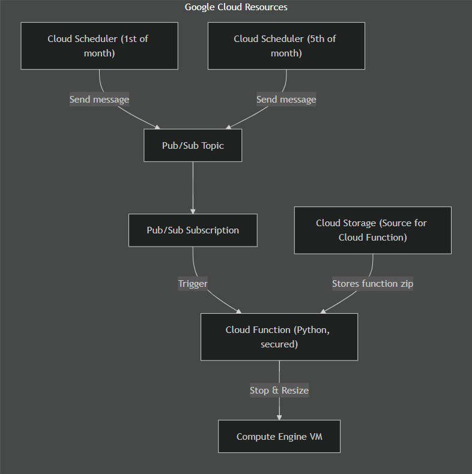

# 🔁 Scheduled Compute Engine VM re-sizer on GCP

This project automates the resizing of a Google Cloud Compute Engine virtual machine (VM) on a schedule using:

- **Cloud Scheduler** – to trigger resize events
  <br />
- **Pub/Sub** – as the messaging layer
  <br />
- **Cloud Functions (2nd Gen)** – for executing the VM stop, resize, and restart operations
  <br />
- **Compute Engine** – the VM being resized
  <br />
- **Cloud Storage** – to host the source archive for the function
  <br />
- **Terraform** – to provision and manage all infrastructure
  <br />
  <br />

## 📦 Features

- Automatically resizes a VM up on the **1st day** of the month.
  <br />
- Resizes the VM down on the **5th day** of the month.
  <br />
- Uses Cloud Function with a **protected entry point** triggered by Pub/Sub.
  <br />
- Deploys entirely using **Terraform** infrastructure as code.

<br />
<br />

## 🗂️ Project Structure

```
terraform/
    ├── main.tf
    ├── variables.tf
    ├── outputs.tf
    └── ...
tf-function/
└── main.py  # Cloud Function source

```

<br />
<br />

## 🔧 How It Works

### 1. **Cloud Scheduler Jobs**

- Two scheduler jobs are created:
  - `resize_up`: Triggers on the **1st** of the month.
  - `resize_down`: Triggers on the **5th** of the month.
    <br />

### 2. **Pub/Sub Topics**

- Each job publishes a message to its corresponding Pub/Sub topic.
- The message payload includes:
  - `project_id`
  - `zone`
  - `instance_name`
  - `new_machine_type`
    <br />

### 3. **Cloud Functions**

- Two cloud functions subscribe to each topics.
- It:
  - Stops the VM
  - Changes the machine type (if different)
  - Restarts the VM
    <br />

### 4. **IAM & Permissions**

- A custom service account is used for the Cloud Function.
- Required permissions:
  - `compute.instances.get`
  - `compute.instances.stop`
  - `compute.instances.start`
  - `compute.instances.setMachineType`

<br />
<br />

## 🚀 Deployment

<br />

### ✅ Prerequisites

- GCP project with billing enabled
- Terraform installed
- Python 3.12 (for local testing if needed)
  <br />

### 🔐 Required APIs

Enable these in your project:

- Compute Engine API
- Cloud Functions API
- Cloud Pub/Sub API
- Cloud Scheduler API
- Cloud Storage API
- IAM API
- Service Usage API

<br />
<br />

### 📥 1. Clone this repo

```bash
git clone https://github.com/cfcife/gcp-vm-resizer.git
cd gcp-vm-resizer
```

<br />

### ⚙️ 2. Configure Terraform Variables

Edit `terraform.tfvars` file to customize:

```hcl
scheduler_jobs = {
  resize_up = {
    schedule   = "0 9 1 * *" # 1st day of the month at 9am UTC
    topic_name = "resize-up-topic"
    data = {
      project_id       = "your-project-id"
      zone             = "us-central1-f"
      instance         = "your-instance-name"
      new_machine_type = "e2-medium"
    }
  }
  resize_down = {
    schedule            = "0 9 5 * *" # 5th day of the month at 9am UTC
    topic_name          = "resize-down-topic"
    data = {
      project_id       = "your-project-id"
      zone             = "us-central1-f"
      instance         = "your-instance-name"
      new_machine_type = "e2-micro"
    }
  }
}
```

<br />

### 📦 3. Package the Function

From the `src/` directory:

```bash
zip -r function.zip .
```

Add the path to the gcs bucket in `terraform/main.tf`:

<br />

### 🚀 4. Deploy with Terraform

```bash
cd terraform
terraform init
terraform fmt & terraform validate
terraform apply
```

<br />

## 📄 IAM Roles

The Cloud Function's service account needs the following roles:

- `roles/compute.instanceAdmin.v1`
- `roles/iam.serviceAccountUser`
- `roles/logging.logWriter`
- `roles/pubsub.subscriber`
- `roles/serviceusage.serviceUsageConsumer`

<br />
<br />

## 🔍 Troubleshooting

### ❌ Function Executes Multiple Times

If your function is retrying, check:

- **Pub/Sub retry policy**
- **Function's error output** (403s, timeouts, etc.)
  <br />

### 🔐 Permission Denied

Ensure:

- The service account used by the function has Compute Engine permissions.
- The project IAM policy allows access to the instance resource.

<br />
<br />

## 📈 Diagram



<br />
<br />

## 🧪 Local Testing

To test the function locally:

```bash
python3 src/main.py
```

You can simulate a Pub/Sub event by manually invoking `pubsub_handler(payload, context)`.

<br />

## Other links:

[Don't enable Google APIs by code](https://stackoverflow.com/a/72306829/10864570)

## 📜 License

MIT License. See `LICENSE` file.

<br />

## 👨‍💻 Author

Built by [CFCIFE](https://github.com/CFCIfe) – inspired by scalable GCP infrastructure automation best practices.
